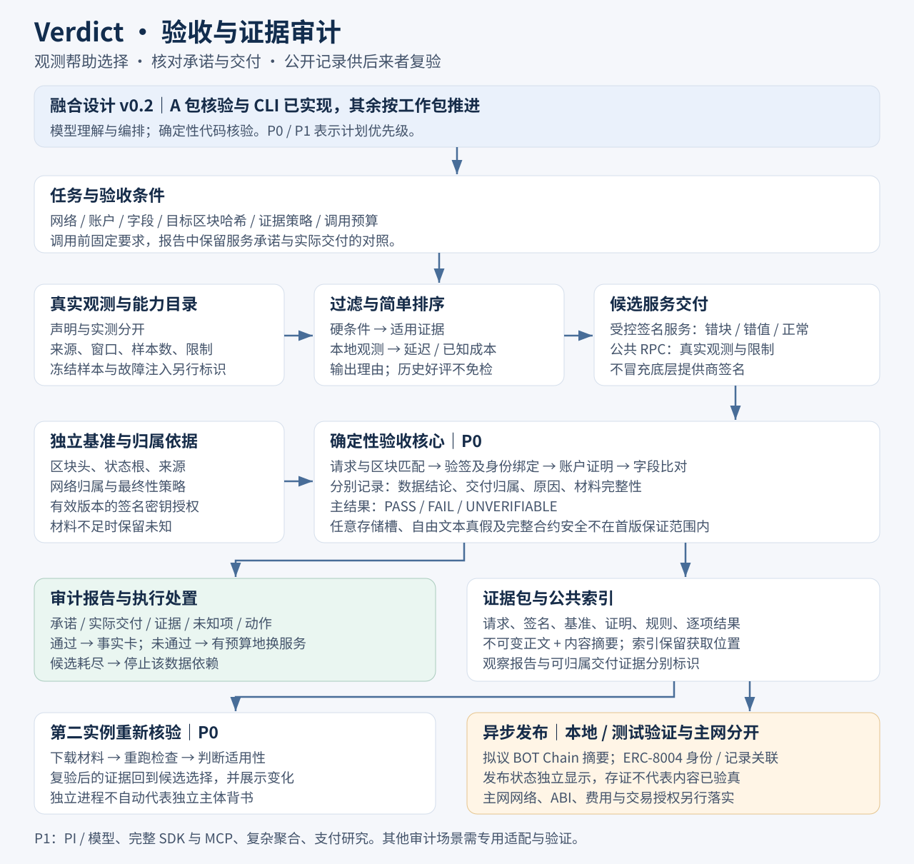

# Verdict Agent

**Agent 服务验收与证据审计：核对承诺与交付，让判断有据可查。**

Verdict 帮助调用外部数据服务的 Agent 明确任务条件、选择候选、核对承诺与实际交付，并共享可复查的审计记录。首个强验收场景是以太坊指定区块的账户状态：历史评价影响先试谁，每次交付仍须重新验收。

**当前阶段：已进入正式开发，协作规则和目录骨架已建立，业务功能尚未实现。** 开发沿用融合设计 v0.2 与三人工作包，先完成共享协议及一条真实验收流程。图中的界面、命令和结果仍是设计示例，不是已运行成果；其他候选方向不替换这套验收审计方案。

## 开发入口

先读 [AGENTS.md](AGENTS.md)，再按岗位查看 [三人工作包](docs/07-三人分工.md)。代码放置、依赖方向和数据位置以 [工程结构](docs/09-工程结构.md) 为准，首批任务见 [开发启动清单](docs/10-开发启动清单.md)。当前决定见 [003](docs/decisions/003-development-kickoff.md)。

A 先落地共享 schema、可信基准与核验；B 建立运行工程、演示服务和调用流程；C 用明确标记的样本开发界面并尽早接真实结果。重要模块有各自的 `AGENTS.md` 和 README。Node、包管理器及库版本将在首个工程提交实际固定，当前不提供尚不存在的启动或测试命令。

## 阅读方案

| 文档 | 内容 |
| --- | --- |
| [产品概要](docs/01-产品概要.md) | 谁遇到什么问题、产品价值与首版范围 |
| [产品需求文档 PRD](docs/02-PRD.md) | 用户流程、需求、优先级与可检查的完成标准 |
| [架构设计图](docs/03-架构设计图.svg) | 选择、验收、证据复用与链上记录的关系 |
| [交互设计图](docs/04-交互设计图.svg) | 三个主视图与失败、未知、复验路径 |
| [技术设计](docs/05-技术设计.md) | 基准、判定、身份签名、证据格式与接口边界 |
| [融合说明与来源](docs/06-融合说明与来源.md) | 初稿与已有方案的取舍、资料依据及待验证项 |
| [三人分工与联调计划](docs/07-三人分工.md) | 三份可直接交接的工作包、目录负责人和阶段门槛 |
| [接口约定草案](docs/08-接口约定.md) | 共享数据对象、核心函数、HTTP 接口与状态语义 |
| [工程结构](docs/09-工程结构.md) | 目录、包依赖、数据位置与模块规则 |
| [开发启动清单](docs/10-开发启动清单.md) | 当前完成状态和第一批实施任务 |
| [决策索引](docs/decisions/README.md) | 历史发布、三人分工及当前正式开发授权 |

## 核心流程

提出任务 → 明确承诺与验收条件 → 按能力和证据排序 → 获取交付 → 逐项对照承诺、实际结果和核验依据 → 通过后供 Agent 使用；未通过则在预算内换服务，候选耗尽就停止该数据依赖。审计报告显示已满足、不符、未知和未覆盖的项目。另一个实例下载证据、重新核验，再判断它是否适用于自己的任务。

- **观测与证明分开**：延迟、超时和限流标明采集来源；状态证明用于核验数据，服务签名用于确认交付归属。
- **结果由代码产生**：模型可理解任务、选择工具、解释结果，不能改写验收结论。
- **历史不免检**：重复好评不增加当前数据的正确性；修复后的新交付可以重新通过。
- **链上摘要可选异步发布**：本地验收与复验不等待链上写入；存证不代表内容被链上验证。

## 实现状态

| 项目 | 状态 |
| --- | --- |
| 产品概要、PRD、技术设计、架构与交互示意 | 已整理并发布；实现参数仍需验证 |
| 协作规则、模块职责目录、开发启动清单 | 已建立；尚未初始化运行工程 |
| 证明验收、签名演示服务、真实观测、指标与排序 | 计划，未实现 |
| 证据包、第二实例复验、网页、最小调用接口 | 计划，未实现 |
| BOT Chain 存证、ERC-8004 接入、SDK/MCP 产品化 | 计划，未部署或接入 |
| 反事实清算调查 | 备选方向；已有的本地单笔实验不属于本仓库服务验收成果 |

首版范围以 [PRD](docs/02-PRD.md) 为准。当前没有可运行应用、安装命令或公开演示链接。赛事匹配属于方案判断，报名、部署与提交要求需以主办方最新通知为准。

## 参与贡献

仓库公开，欢迎查看、Fork、提交 Issue 和 Pull Request。修改设计时请同时检查 PRD、技术设计和图示的一致性，并区分计划、已验证事实与未决问题。贡献说明见 [CONTRIBUTING.md](CONTRIBUTING.md)。

采用 [MIT License](LICENSE)。外部标准与参考资料归各自权利人，本仓库不包含第三方上游源码、原始赛事手册或本地运行证据。
