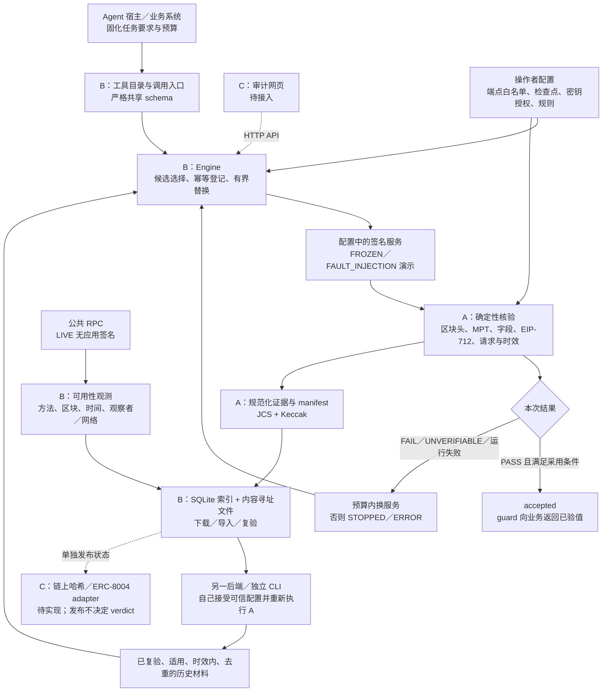
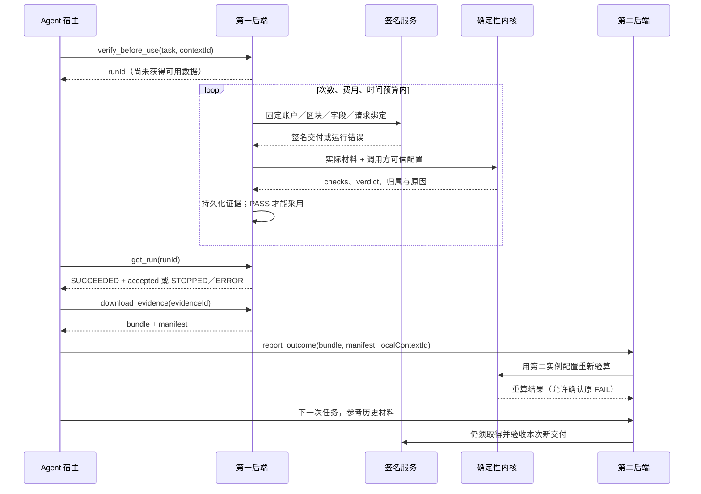

# Agent 工具与出海服务验收

2026-10-07，北京时间。基于已合并的 A 内核和 B 后端增加工具接入、观测来源与 Windows 联调；不替换已有 npm workspace。当前范围为 Ethereum 指定区块的账户状态验收。

## 1. 产品方向

Verdict 是 **Agent 调用服务时的验收层**。Agent／宿主先声明交付条件，后端调用配置中的服务，确定性代码核对本次交付；失败则在预算内替换，全部不合格则停止依赖。每份实际交付留下包含请求、签名响应、证明、基准描述、规则和逐项结果的证据包。另一实例按自行接受的可信配置重验，历史材料只改变下次选择，每次新交付仍须验收。

面向出海 Agent 服务商的应用与此一致：研究 Agent、钱包助手或链上业务助手在接入不熟悉的区域服务时，需要控制错误数据进入业务流程的风险。可交付本地验收网关、工具接口、消费端 guard 和可移交的审计材料。当前已实现这些接口与示例，尚未部署为公众多租户服务。

三类判断必须独立：

| 判断 | 目前能回答的内容 | 不能据此宣称 |
| --- | --- | --- |
| 本次数据正确性 | 在调用方接受的 Ethereum 区块／stateRoot 下，账户证明与指定字段是否一致 | 任意 API 的语义正确性、实时最新状态、独立共识最终性 |
| 本次服务归属 | EIP-712 签名是否符合独立配置的密钥授权和请求绑定 | 本地适配器签名就是公共 RPC 厂商签名 |
| 接入可用性 | 指定观察者、方法、区块、时间和网络条件下的响应／限制／超时 | 全球 SLA、厂商作恶、跨境合规或数据驻留认证 |

**ERC-8004 的准确位置**：2026-10-07 读取的[官方草案](https://eips.ethereum.org/EIPS/eip-8004)已经包含 Identity、Reputation 和 Validation Registry。Validation Registry 提供独立验证结果的通用登记接口；Verdict 提供账户状态任务的验收实现和可复验材料。不要声称标准完全缺少验证功能。注册和公开反馈也不能自动证明能力有效；该草案安全说明明确讨论了女巫攻击及能力真实性限制。当前未连接 ERC-8004 合约。

## 2. 技术架构



运行依赖保持 `protocol ← core ← evidence`；`server` 组合这些包和 observations，消费端通过 HTTP 使用共享 schema。模型无法向工具调用注入新服务 URL、可信区块、密钥、规则实现或最终 verdict。可选择的 contextId 必须事先由操作者配置；真实业务中宿主还应锁定允许的任务、预算与 contextId，不能把自然语言工具描述当授权系统。



## 3. 工具接口和消费方法

`GET /api/tools` 返回 `{apiVersion, tools:[{name,description,inputSchema}]}`。JSON Schema 由 `@verdict/protocol` 的 Zod 定义生成；不用第二套手写字段。`POST /api/tools/call` 接受 `{name,arguments}`，成功 HTTP 200 返回 `{apiVersion,result}`。提交任务得到 ID，**HTTP 200 和 ID 都不表示验收通过**。错误沿用 400/403/404/409/413/415/422 等现有边界。

| 工具 | 参数 | 返回与语义 |
| --- | --- | --- |
| `describe_environment` | `{}` | 已配置的策略、区块和声明能力；不包含密钥或端点 |
| `find_service` | `CreateRun` | 候选、适用证据及排序理由；不调用交付服务 |
| `verify_before_use` | `CreateRun` | `{runId,duplicate}`；后台验收与替换 |
| `get_run` | `{runId}` | `RunSnapshot`；仅 SUCCEEDED 且 accepted 非空可采用 |
| `download_evidence` | `{evidenceId}` | `{bundle,manifest}`；读取时检查存储内容摘要 |
| `report_outcome` | `{bundle,manifest,contextId}` | 实际重算后导入；报告篡改、UI_MOCK、错误来源／上下文被拒绝 |
| `replay_evidence` | `{evidenceId,contextId}` | `{replayId}`；重验已有材料 |
| `get_replay` | `{replayId}` | 重算结果、完整性及报告一致性；COMPLETED 可确认 FAIL |

这是一组宿主无关的函数工具接口，**尚非完整 MCP server，也未接入 LLM SDK**。宿主可把本地工具目录适配到其模型工具格式，保留参数验证和确定性采用规则。工具结果、服务文本与证据内容都是数据，不能作为系统指令；大证据包应由宿主在 API 间传递，不必经过模型上下文。

```ts
import { guard, AcceptanceStopped } from '@verdict/consumer';

try {
  const accepted = await guard('http://127.0.0.1:3001', taskInput);
  // 只有这里才能把 accepted.values 交给研究或交易前分析。
  // taskInput 由宿主固定任务条件、contextId、请求 ID 和预算。
} catch (error) {
  if (!(error instanceof AcceptanceStopped)) throw error;
  // 中止该数据依赖；使用 error.run 查询逐次失败依据，不能静默用原始响应。
}
```

网络响应不确定时以**相同 requestId 和相同输入**查询或重试，不能盲目生成新 requestId。不同输入复用相同 ID 会冲突。第二实例重验旧包时可能因过期或基准／授权变化拒绝导入；历史时间策略由操作者单独接受，不能从包内自授权。

## 4. 出海场景的观测来源

可选后端配置：

```json
{
  "rpcObservationOrigin": {
    "observerId": "operator-probe-hk-01",
    "region": "HK",
    "networkProfile": "operator-direct",
    "provenance": "OPERATOR_CONFIGURED"
  }
}
```

这是部署者声明的来源标签，示例不代表我们已在香港或多地区完成实测。region、networkProfile 允许 null；未配置则不输出 origin，不根据语言、IP 或时区猜测地区。标签限制为 1–80 个字母／数字／点／下划线／连字符，避免把认证 URL 填进公开元数据。不要在这些标签里写秘密。

仅配置中的 RPC 探测生成该元数据，POST `/api/observations` 仍只接受空对象；Agent 不能自报“已在某地区验证”。SQLite 保存来源，24 小时指标按来源模式、方法、区块、观察者、地区、网络配置分组，不把不同接入条件的延迟混为一个平均数。所有这种观测仍为 `correctness=NOT_CHECKED`。

这是观测 schema 的可选扩展；旧记录可读，默认无配置时输出保持原形状。启用来源字段的 B/C 应一起更新共享 protocol，旧版本严格 schema 不能读新增字段。**A 的证据、TaskSpec、签名域、schemaVersion 1.0.0 和 eth-account-v1 未变**；没有把地区声明放进已签名账户证明或据此改变数据 verdict。

## 5. 数据权威性与业务覆盖检查

优先证据为 Ethereum 区块头、账户证明和独立接受的检查点。[已有数据集](12-测试数据来源与覆盖.md)共 10 个账户／区块组合、6 个不同区块；manifest 固定 RPC 来源、采集时间、哈希和预期值。涵盖跨时期合约、有余额且 nonce=0 的无代码账户、高 nonce 无代码账户、零余额合约和不存在地址。本次沿用并重跑这些真实材料，**没有新增未经审阅的生产事故数据或证明样本**。

权威性来自明确规范和可计算证据，不能只依据提供商名称。公共 RPC 是取证渠道；其输出须相对调用方接受的基准检验。跨两个 RPC 核对不自动构成独立共识验证，两个端点也可能共用基础设施。

| 情况 | 当前行为／证据 | 已验证或明确边界 |
| --- | --- | --- |
| 正确的指定账户和区块 | 头哈希、MPT、字段、授权签名和请求检查；PASS 后采用 | A 真实主网样本 + B HTTP 集成 |
| 格式正确但区块错／数值错 | BLOCK_MISMATCH／FIELD_MISMATCH，保留签名材料再换服务 | 五进程与工具链实测；人工故障明确标注 |
| 另一账户证明、坏／截断证明 | 不允许通过；检查项给出具体原因 | A 负例；不将缺材料伪造为有效证明 |
| 缺证明、缺头、缺字段 | 证据不足时 UNVERIFIABLE | 当前验收必需条件不可由模型放宽 |
| 缺／坏签名或授权失效 | 数据与服务归属分别检查，不构成可归属厂商反证 | A/B 测试；本地签名不等于厂商背书 |
| 历史正确数据与“过期数据” | 历史任务可以合法要求旧块；返回非目标块才违反固定任务 | 不把旧高度一概认定为 stale；动态最新块策略待扩展 |
| 重组、未最终确认、基准冲突 | 依据显式可信配置；缺少／冲突基准不采用 | 未实现共识轻客户端或重组监控 |
| 429、超时、403、方法／范围不支持 | 保存不同观测；有界替换／停止；不归责为造假 | 受控 HTTP 测试，既有 LIVE RPC 记录另存 |
| 次数／费用／时间用完、未知报价 | 停止；未知价格不当免费；无未验数据 fallback | B 预算测试 |
| 重复请求、并发、崩溃重启 | 相同输入幂等；原子采用；不确定旧调用停止 | B 原子性／重启测试；没有分布式队列 |
| 改报告为 PASS、改包、UI_MOCK | 摘要及重算检查后拒绝导入 | A/B 与新增工具入口负例 |
| 重复证据、旧版本／失效授权、服务修复 | 事实去重、适用性／时效重算；修复后可再次通过 | 不是投票、总分或永久黑名单 |
| 下载、第二实例重验、历史改变排序 | 完整材料转移后再验；新任务仍有本次 PASS | 独立进程和存储实测；不是独立组织背书 |
| 跨地区／代理可用性差异 | 保存操作者声明的观察点并分组 | 元数据路径与分组已测试；全球实测待做 |
| 锚定失败／尚未部署 | 发布状态独立，不改写本地 verdict | 队列故障测试已有；真实链上 adapter 待 C |
| 价格／新闻／自然语言分析等通用 API | 需要额外可判定交付协议和规则 | 不属于 eth-account-v1，不能套用账户证明声称覆盖 |

因此，当前 P0 主闭环可运行；“覆盖所有服务、所有地区、所有账户分叉边界”的说法没有依据。精确硬分叉相邻块、授权代码账户与更多 Trie 向量仍按数据集待补清单推进。Bitfinex 行情不是账户状态的真值源；ethskills 和 SpeedRunEthereum 适合开发指导，不能替代 EIP、执行规范和真实证明材料。附件中的事件叙述及不可解析的 citation 标记不直接作为生产事故结论。

本轮重新读取的官方依据：

| 官方资料 | 核对结果与约束 |
| --- | --- |
| [EIP-1186](https://eips.ethereum.org/EIPS/eip-1186) | eth_getProof 与相对可信 stateRoot 的离线验证；文档状态为 Stagnant，不能称为 Final 标准 |
| [EIP-1898](https://eips.ethereum.org/EIPS/eip-1898) | 固定 blockHash，requireCanonical 表示被调用节点的规范链判断；不等于本系统独立验证共识 |
| [EIP-712](https://eips.ethereum.org/EIPS/eip-712) | 类型化签名，本身不提供重放保护；必须保留 requestId、时效与消费记录 |
| [ERC-8004 官方源文档](https://github.com/ethereum/ERCs/blob/master/ERCS/erc-8004.md) | Draft；身份、信誉和验证登记接口；能力真实性及女巫攻击限制 |

原始文档在本机 `.local/references/` 留存，本轮仅引用，不复制进公开测试资产。后续试验资产固定提交／发布版本和许可证，既有官方 Trie／execution-specs 候选入口见数据集文档。

## 6. 运行、实测与交接

```bash
npm ci --ignore-scripts
npm run typecheck
npm run test:all
npm run verify:local
```

使用 Node 22.23.3 / npm 10.9.9。`verify:local` 在 `.local/verify-local-*` 下创建新密钥、独立数据库与证据目录，启动三个签名服务和两个后端，使用系统分配的端口，并检查各进程 launchId。先跑完整 B 闭环，再通过全部工具接口复现替换、停止和第二实例重验。退出时只结束本次持有句柄的子进程；不依赖 Linux `/proc`，不操作其他演示进程，保留本次本地证据。

2026-10-07 Windows 实测：类型检查、A 的 48 项回归、B 的 26 项集成测试通过（包括新增 4 项）；五进程演示通过。错区块／错值拒收、正常服务采用、全失败停止、第二实例复算 FAIL、历史开关改变选择且新交付再验收均已运行。发布仍 `not_requested`。Linux／Windows CI 已配置，远端实际结果以 GitHub Actions 为准。

C 可直接使用原 HTTP API 或工具接口；原始 bundle 下载仍使用 `/api/evidence/:id/bundle`。现有 Linux `dev:start/dev:stop` 保留；Windows 使用 `verify:local` 或各进程前台入口。若已有运行后端，可单独执行 `npm run example:tools -- http://127.0.0.1:3001 http://127.0.0.1:3002`。

剩余交付：C 网页与浏览器端到端测试、真实锚定 adapter、完整 MCP／模型宿主接入、真正多地区部署及长时间观测、生产认证／隔离／限额和公开演示链接。当前不存在全球 SLA、厂商事故公告认证、合规认证或主网部署结果。
